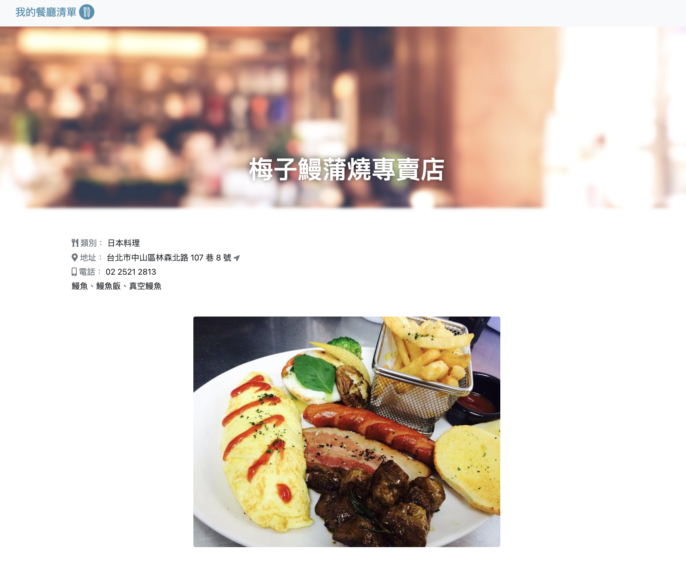

# Foodie Bucket List


## 📖 Introduction

This website is a Foodie Bucket List in Taipei which contains all restaurants’ addresses, phone numbers, categories, and ratings. Moreover, you can use the search bar to check certain restaurants. Lastly, you can click one of the lists to view the detailed description of restaurants.

## 🎮 Features
Users can overview all restaurants, including:
- Restaurant pictures
- Restaurant names
- Phone numbers

Users can view the detail of the restaurant, including:
- Restaurant names
- Phone numbers
- Addresses and google map
- The detail of the description


Users can use the search bar to check certain restaurants
- When it’s a typo, and cannot find any restaurant, it will display an error message
  

## 🛠️ Installation
```
# Clone this repository
$ git clone https://github.com/Lilynews/restaurant.git

# Project setup
$ npm install

# after setup, type
$ npm run start

# if the message shows like below, please open the web page and type the URL: http://localhost:3000, and you can entre this website
"Express is listening on localhost:3000"

# To stop the project
ctrl + c
```

## 👩🏻‍💻 Tech/framework used
- VScode 1.73.1
- Express 4.16.4
- Express-handlebars 3.0.0
- bootstrap 5.1.3
- font-awesome

## 🗺️ Roadmap

- [x]  List of restaurants
    - Details of each restaurant
        - [x]  Category, address, phone, description
        - [ ]  Embedded google map
        - [ ]  Embedded google review
    - [x]  Search bar
        - Foolproof design
            - [x]  when type space
            - [x]  when a typo cannot be found
        - [ ]  Drop-down option by name
        - [ ]  Drop-down option by category
        - [ ]  Drop-down option by rating
        - [ ]  Drop-down option by location
- [ ]  Connect Funyooo website
- [ ]  Front-end optimization
    - [ ]  Tab name when switching different pages
    - [ ]  Fix certain page part